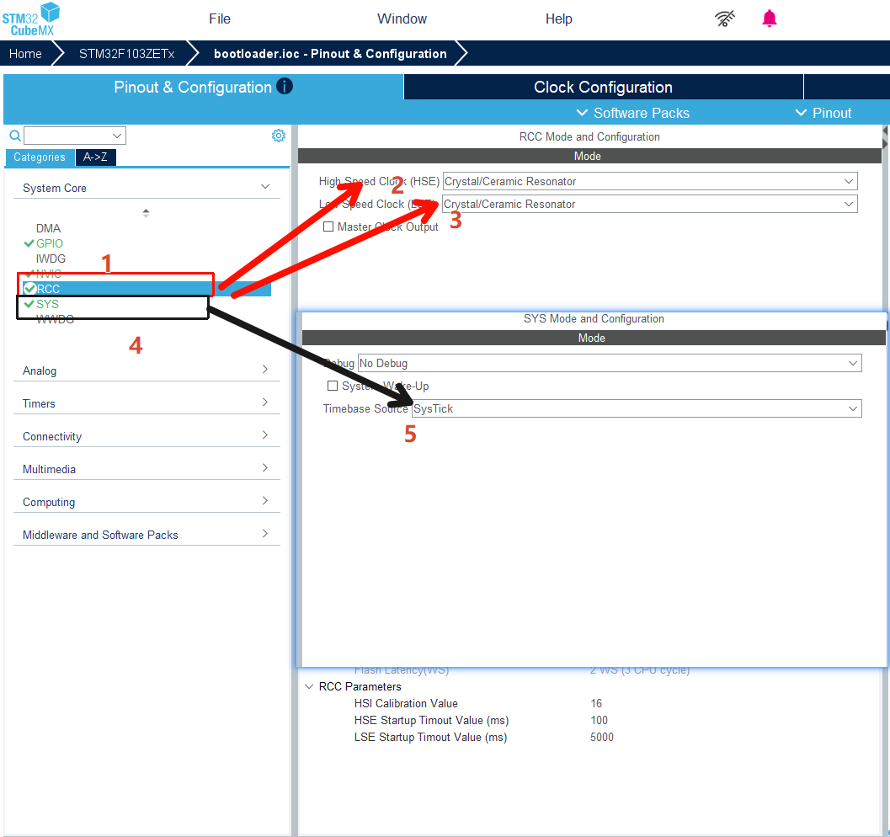
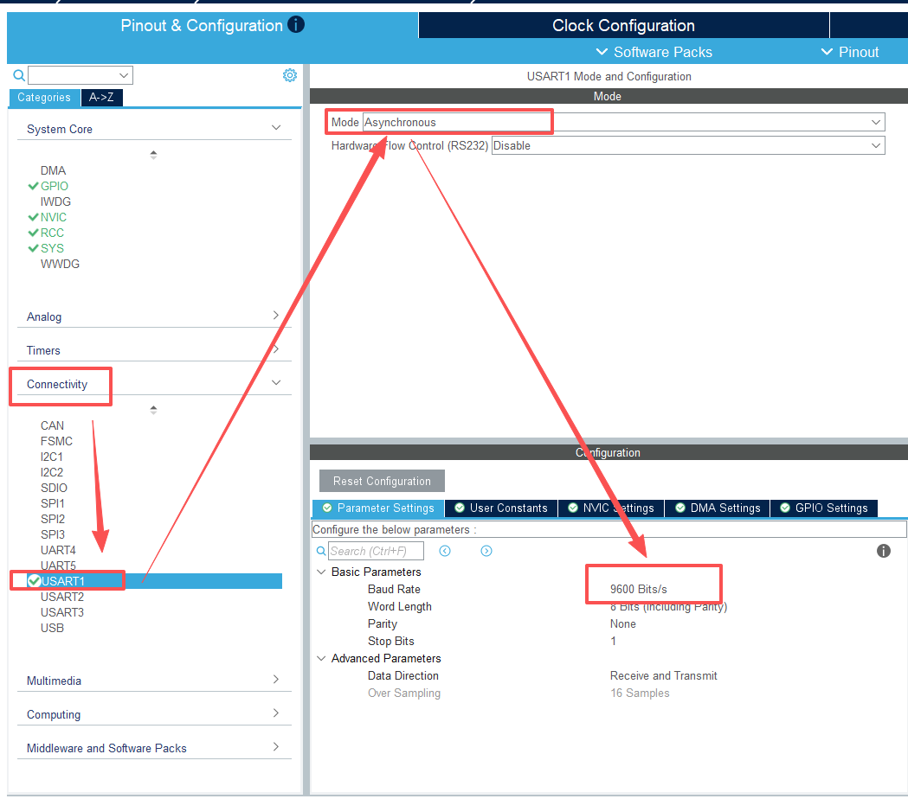
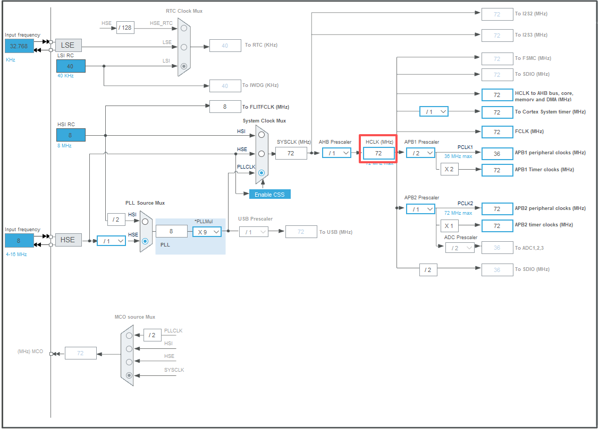
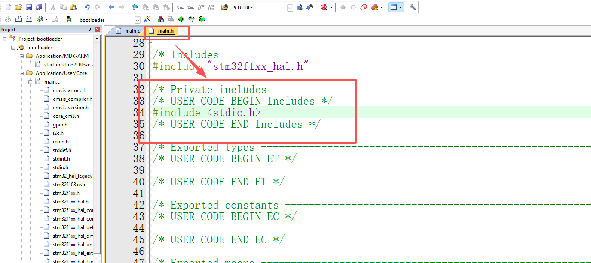
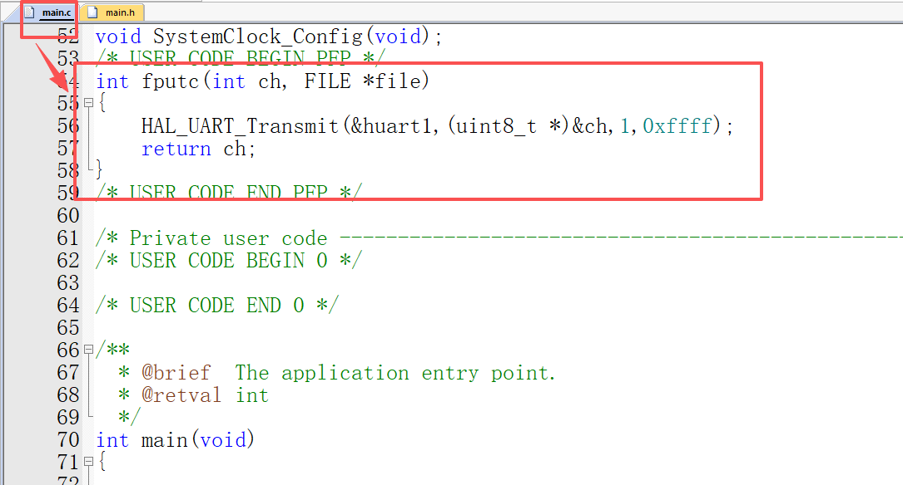
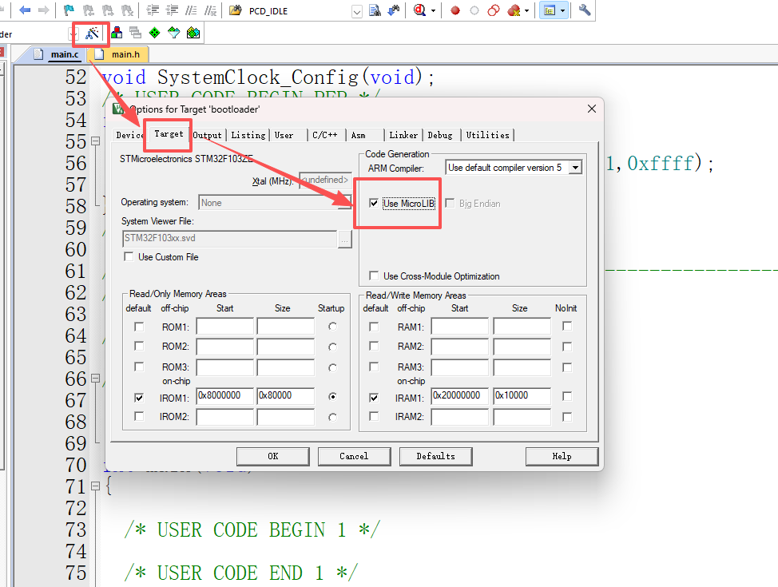
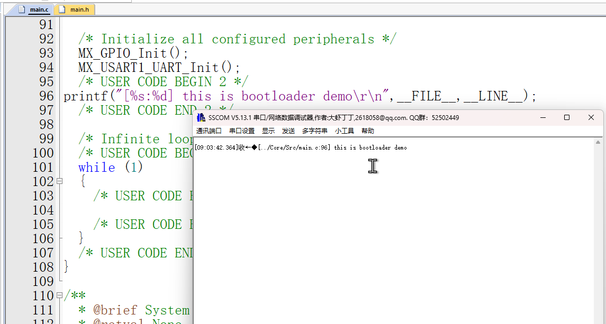
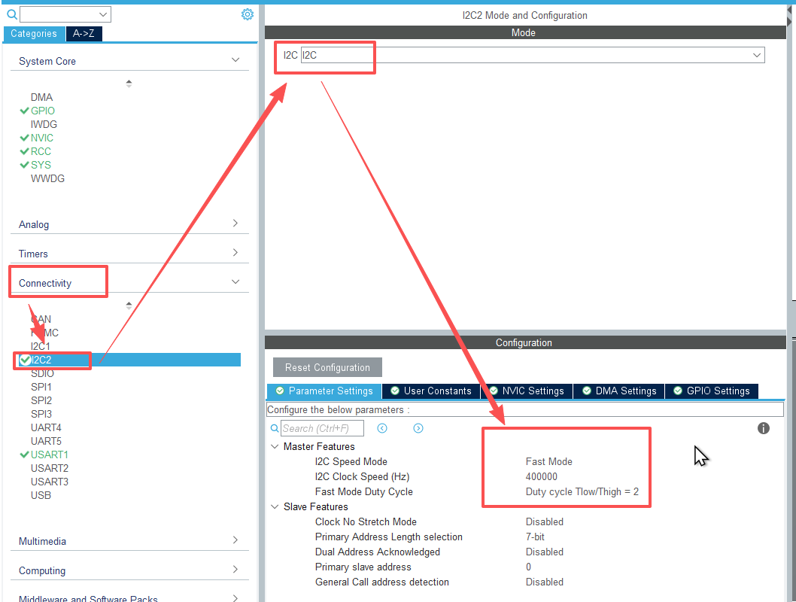
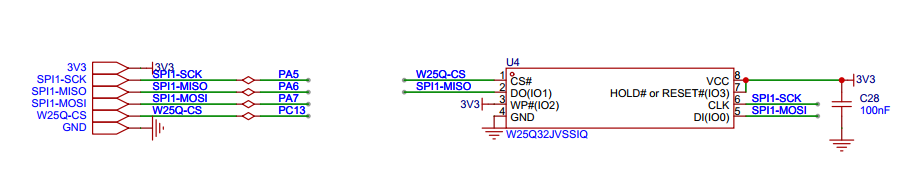
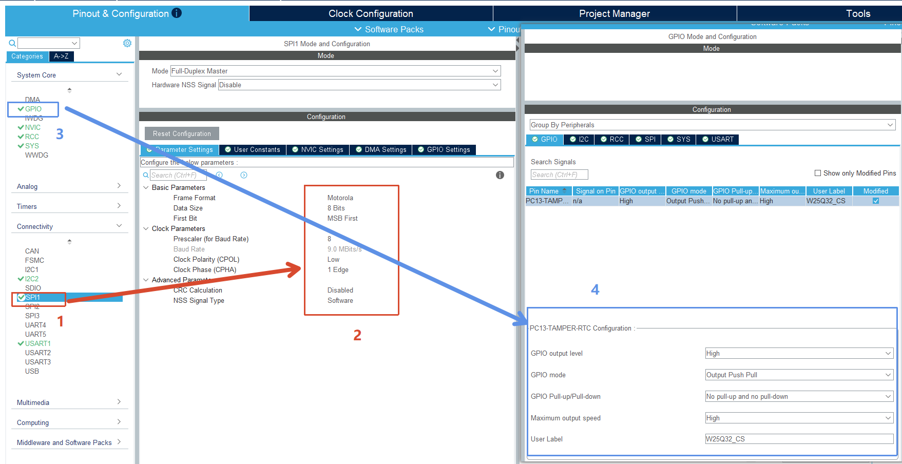

# OTA学习笔记 #

## 前言

此笔记为OTA的学习笔记，学习参考bilibili的up主尚硅谷的[零基础OTA-BootLoader教程， ota远程升级，BootLoader程序设计bilibili](https://www.bilibili.com/video/BV11C65BDEJx/?vd_source=d4f13896e48b8d93ca6850bd2ae23031)视频，不赘述理论知识，只记录本人学习OTA的过程，及遇到的难题解决方式

## 准备

### 硬件

stm32f103开发板带spi-flash

st-link烧录器/j-link烧录器

串口转ttl调试器

### 软件

keil

STM32CubeMX

VsCode

STM32 ST-LINK Utility

sscom

## 项目规划

需要创建的项目

1.B区代码项目：[BootLoader](./BootLoader/)——用于程序跳转，固件升级

2.A区代码项目：[Application](./Application/)——正常运行的程序

## 分区说明

App——运行正常程序的分区

Boot——运行BootLoader的分区

download——存放下载固件的分区

factory——恢复出厂设置的分区（无）

AB分区指的是Application分区与BootLoad分区，而不是运行正常程序的分区分成A、B区做回滚

## OTA升级

### stm32f103zet6 + eeprom + spi-flash

使用eeprom存储是否需要升级的标志位，A区代码检测到需要升级请求之后会将固件下载到spi-flash，然后进行固件校验，当校验通过后将eeprom存储的升级标志位设置成1，然后进行重启，重启后首先执行b区代码，先检测eeprom的升级标注位，为1则将spi-flash中的固件写入到0x08004000地址，然后跳转到0x08004000执行新固件

#### 创建项目

1.创建初始化项目，使用串口1进行日志打印







项目初期要使用串口接收并保存固件，波特率不能设置太快，先选中9600bps如果稳定后再考虑115200bps。

2.重写fputc函数实现日志打印



重写fputc函数要用到`FILE`结构体所以需要引入标准io头文件，因为main.h是hal库生成的驱动层代码都会引入的所以将操作写在main.h头文件中





如果要使用串口打印必须勾选`Use MicroLIB`



#### 使用EEPROM

使用stm32f103zet6的iic2驱动m24c02来存储OTA是否需要升级及升级的步骤m24c02芯片内存为2*1024bit/8 = 256byte，芯片分为16页，每页16字节

内存规划：

|      | 0                    | 1        | 2        | 3        |
| ---- | -------------------- | -------- | -------- | -------- |
| 页0  | 是否升级(0:否，1:是) | 升级步骤 | 校验位高 | 校验位低 |

1.cubemx构建iic



代码如下：

```iic.h
#ifndef __INF_IIC_H__
#define __INF_IIC_H__

#include "i2c.h"


/**
 * @brief 写入多字节数据
 * 
 * @param chip_address 芯片的物理地址
 * @param address 要写入的内存地址
 * @param data 要写入的数据
 * @param data_length 要写入的数据的长度
 * @return HAL_StatusTypeDef ：HAL_OK=0x00U,HAL_ERROR=0x01U,HAL_BUSY=0x02U,HAL_TIMEOUT=0x03U
 */
HAL_StatusTypeDef Inf_IIC_WriteBytes(uint8_t chip_address,uint8_t address,uint8_t *data, uint16_t data_length);

/**
 * @brief 读取多字节数据
 * 
 * @param chip_address 芯片的物理地址
 * @param address 要读取的内存地址
 * @param data 要读取数据的缓冲区
 * @param data_length 要读取数据的长度
 * @return HAL_StatusTypeDef：HAL_OK=0x00U,HAL_ERROR=0x01U,HAL_BUSY=0x02U,HAL_TIMEOUT=0x03U
 */
HAL_StatusTypeDef Inf_IIC_readBytes(uint8_t chip_address, uint8_t address,uint8_t *data,uint16_t data_length);
#endif

```

```IIC.c
#include "Inf_IIC.h"


/**
 * @brief 写入多个字节数据
 * @note 向指定地址写入多个字节数据
 * 
 * @param chip_address：芯片的写地址（往哪个芯片写）
 * @param address：写入的内存地址（往芯片哪个地址写）
 * @param data：写入的数据
 * @param data：写入的长度
 * 
 * @return HAL_StatusTypeDef：HAL_OK=0x00U,HAL_ERROR=0x01U,HAL_BUSY=0x02U,HAL_TIMEOUT=0x03U
 */
HAL_StatusTypeDef Inf_IIC_WriteBytes(uint8_t chip_address,uint8_t address,uint8_t *data, uint16_t data_length)
{
	return HAL_I2C_Mem_Write(&hi2c2,chip_address,address,I2C_MEMADD_SIZE_8BIT,data,data_length,100);
}


/**
 * @brief 读取多个字节数据
 * @note 向指定地址读取多个字节数据
 * 
 * @param chip_address：芯片的读地址（往哪个芯片读）
 * @param address：读取的内存地址（往芯片哪个地址读）
 * @param data：读取的数据缓冲区
 * @param data_length：读取的个数
 * 
 * @return HAL_StatusTypeDef：HAL_OK=0x00U,HAL_ERROR=0x01U,HAL_BUSY=0x02U,HAL_TIMEOUT=0x03U
 */
HAL_StatusTypeDef Inf_IIC_readBytes(uint8_t chip_address, uint8_t address,uint8_t *data,uint16_t data_length){
	return HAL_I2C_Mem_Read(&hi2c2,chip_address,address,I2C_MEMADD_SIZE_8BIT,data,data_length,100);
}

```

```m24c02.h
#pragma once

#include "Inf_IIC.h"
#include "Com_Config.h"

#define M24C02_CHIP_PAGE_SIZE 16    //芯片页大小
#define M24C02_CHIP_ADDRESS 0x50    //芯片物理地址
#define M24C02_WRITE_ADDRESS (M24C02_CHIP_ADDRESS << 1)     //芯片的写入地址 七位物理地址+一位读写位，读写位读1写0
#define M24C02_READ_ADDRESS (M24C02_CHIP_ADDRESS <<1 |0x01) //芯片的读取地址 七位物理地址+一位读写位，读写位读1写0

/**
 * @brief 写入一个字节数据
 * 
 * @param address  写入地址
 * @param data 写入数据
 * @return HAL_StatusTypeDef ：HAL_OK=0x00U,HAL_ERROR=0x01U,HAL_BUSY=0x02U,HAL_TIMEOUT=0x03U 
 */
HAL_StatusTypeDef App_M24c02_WriteByte(uint8_t address, uint8_t data);


/**
 * @brief 写入多个字节数据
 * @note  向m24c02指定地址写入多个字节数据，16byte一页，超过16字节需要重写地址要不然会从页头覆盖写入
 *				例如：从0地址写入26个字母，abcd efgh ijkl mnop 再继续写的话需要再重写调用写入函数并重新计算写入地址否则 
 *              qrst……会替换掉前面的abcd……，最终变成 qrst uvwx yzkl mnop，此函数以实现自动翻页写入
 * 
 * @param address：写入地址
 * @param data：写入数据
 * @param data_length：写入数据长度
 * 
 * @return HAL_StatusTypeDef：HAL_OK=0x00U,HAL_ERROR=0x01U,HAL_BUSY=0x02U,HAL_TIMEOUT=0x03U  
 */
HAL_StatusTypeDef App_M24c02_WriteBytes(uint8_t address, uint8_t* data, uint16_t data_length);


/**
 * @brief 读取一个字节
 * @note	从eeprom的指定地址读取一个字节数据
 * 
 * @param：address 读取地址
 * @param：data 读取数据缓冲区
 * 
 * @return HAL_StatusTypeDef：HAL_OK=0x00U,HAL_ERROR=0x01U,HAL_BUSY=0x02U,HAL_TIMEOUT=0x03U  
 */
HAL_StatusTypeDef App_M24c02_readByte(uint8_t address,uint8_t *data);


/**
 * @brief 读取多个字节
 * @note	从eeprom的指定地址读取多个字节数据
 * 
 * @param：address 读取地址
 * @param：data 读取数据缓冲区
 * @param：data_length 读取数据长度
 * 
 * @return HAL_StatusTypeDef：HAL_OK=0x00U,HAL_ERROR=0x01U,HAL_BUSY=0x02U,HAL_TIMEOUT=0x03U  
 */
HAL_StatusTypeDef App_M24c02_readBytes(uint8_t address,uint8_t *data,uint16_t data_length);


/**
 * @brief 校验存储数据合法性
 * @note  校验存储的数据有没有被破环 0-是否升级标志，1-升级步骤标志，3、4-校验和（后期可能会改成 3-当前使用APP区1还是APP区2，4、5-校验和）
 * 				校验方式为当前有效数据的异或值
 * @param NULL
 * 
 * @return HAL_StatusTypeDef：HAL_OK=0x00U,HAL_ERROR=0x01U,HAL_BUSY=0x02U,HAL_TIMEOUT=0x03U 
 */
HAL_StatusTypeDef App_M24C02_check_data(void);


/**
 * @brief 初始化M24C02
 * @note	校验M24C02存储的升级标志
 * 
 * @param NULL
 * 
 * @return HAL_StatusTypeDef：HAL_OK=0x00U,HAL_ERROR=0x01U,HAL_BUSY=0x02U,HAL_TIMEOUT=0x03U 
 */
HAL_StatusTypeDef App_M24C02_Init(void);


/**
 * @brief 更新OTA升级步骤
 * @note  更新OTA升级步骤 需要同步更新校验值到eeprom
 * 
 * @param enum OTA_UPDATA_STEP_E  新的步骤
 * 
 * @return HAL_StatusTypeDef：HAL_OK=0x00U,HAL_ERROR=0x01U,HAL_BUSY=0x02U,HAL_TIMEOUT=0x03U   
 */
HAL_StatusTypeDef App_M24c02_Updata_OTA_Updata_Step(enum OTA_UPDATA_STEP_E new_updata_step);


/**
 * @brief 更新OTA升级状态
 * @note  更新OTA升级状态 需要同步更新校验值到eeprom
 * 
 * @param enum OTA_UPDATA_STEP_E  新的状态
 * 
 * @return HAL_StatusTypeDef：HAL_OK=0x00U,HAL_ERROR=0x01U,HAL_BUSY=0x02U,HAL_TIMEOUT=0x03U   
 */
HAL_StatusTypeDef App_M24c02_Updata_OTA_Updata_State(enum OTA_UPDATA_E ota_updata);


/**
 * @brief 更新OTA升级新固件大小
 * @note  更新OTA升级新固件大小
 * 
 * @param new_code_size新固件大小
 * 
 * @return HAL_StatusTypeDef：HAL_OK=0x00U,HAL_ERROR=0x01U,HAL_BUSY=0x02U,HAL_TIMEOUT=0x03U   
 */
HAL_StatusTypeDef App_M24c02_Updata_New_Code_Size(uint32_t new_code_size);

```

```m24c02.c
#include "App_M24c02.h"


#include <string.h>
/**
 * @brief 写入一个字节数据
 * @note 向m24c02指定地址写入一个字节数据，写入后要给芯片留至少5ms的时间留给芯片进行写入，所以需要在写入后延时n（10）ms
 * 
 * @param address：写入地址
 * @param data：写入的数据
 * 
 * @return HAL_StatusTypeDef：HAL_OK=0x00U,HAL_ERROR=0x01U,HAL_BUSY=0x02U,HAL_TIMEOUT=0x03U 
 */
HAL_StatusTypeDef App_M24c02_WriteByte(uint8_t address, uint8_t data)
{

	HAL_StatusTypeDef ret =	Inf_IIC_WriteBytes(M24C02_WRITE_ADDRESS,address,&data,1);
	HAL_Delay(10);
	return ret;
}

/**
 * @brief 写入多个字节数据
 * @note  向m24c02指定地址写入多个字节数据，16byte一页，超过16字节需要重写地址要不然会从页头覆盖写入
 *				例如：从0地址写入26个字母，abcd efgh ijkl mnop 再继续写的话需要再重写调用写入函数并重新计算写入地址否则 
 *              qrst……会替换掉前面的abcd……，最终变成 qrst uvwx yzkl mnop，此函数以实现自动翻页写入
 * 
 * @param address：写入地址
 * @param data：写入数据
 * @param data_length：写入数据长度
 * 
 * @return HAL_StatusTypeDef：HAL_OK=0x00U,HAL_ERROR=0x01U,HAL_BUSY=0x02U,HAL_TIMEOUT=0x03U  
 */
HAL_StatusTypeDef App_M24c02_WriteBytes(uint8_t address, uint8_t *data, uint16_t data_length){
		//1.当前页剩余空间
   uint16_t remain_page_size =  M24C02_CHIP_PAGE_SIZE -	address % M24C02_CHIP_PAGE_SIZE;
	//2.剩余空间能存下
	if(remain_page_size > data_length){
		return 	Inf_IIC_WriteBytes(M24C02_WRITE_ADDRESS,address,data,data_length);
	}
	//3.跨页写入
	//3.1保存地址偏移量及保存数据偏移量
	uint16_t save_offset = address+remain_page_size;
	uint16_t data_offset = remain_page_size;
	//3.2先写满当前页

	HAL_StatusTypeDef ret =Inf_IIC_WriteBytes(M24C02_WRITE_ADDRESS,address,data,remain_page_size);
	HAL_Delay(10);
	if(ret != HAL_OK){
		printf("(error->)[%s:%d] iic write fail:%d",__FILE__,__LINE__,ret);
		return ret;
		
	}
	//3.3计算剩余长度
	data_length -= remain_page_size;
	//3.4循环写入16个字节
	for(uint16_t i = 0; i < data_length /M24C02_CHIP_PAGE_SIZE; i++){
		
		ret =	Inf_IIC_WriteBytes(M24C02_WRITE_ADDRESS,save_offset ,data+data_offset,M24C02_CHIP_PAGE_SIZE);
			HAL_Delay(10);
		if(ret != HAL_OK){
			printf("(error->)[%s:%d] iic write fail:%d",__FILE__,__LINE__,ret);
			return ret;
		
		}	
		data_offset += M24C02_CHIP_PAGE_SIZE;
		save_offset += M24C02_CHIP_PAGE_SIZE;
		data_length -= M24C02_CHIP_PAGE_SIZE;
		
	}
	//3.5处理最后剩余的数据
	if(data_length >0){
		ret =	Inf_IIC_WriteBytes(M24C02_WRITE_ADDRESS,save_offset,data+data_offset,data_length);
			HAL_Delay(10);
		if(ret != HAL_OK){
			printf("save_address:%d,save_data%s,save_lenth%d\r\n",save_offset,data+data_offset,data_length);
			printf("(error->)[%s:%d] iic write fail:%d,data:%s,save_address:%d\r\n",__FILE__,__LINE__,ret,data+data_offset,save_offset);
			return ret;
		}
		
	}
	return ret;
}


/**
 * @brief 读取一个字节
 * @note	从eeprom的指定地址读取一个字节数据
 * 
 * @param：address 读取地址
 * @param：data 读取数据缓冲区
 * 
 * @return HAL_StatusTypeDef：HAL_OK=0x00U,HAL_ERROR=0x01U,HAL_BUSY=0x02U,HAL_TIMEOUT=0x03U  
 */
HAL_StatusTypeDef App_M24c02_readByte(uint8_t address,uint8_t *data)
{
		return Inf_IIC_readBytes(M24C02_READ_ADDRESS,address,data,1);
}	

/**
 * @brief 读取多个字节
 * @note	从eeprom的指定地址读取多个字节数据
 * 
 * @param：address 读取地址
 * @param：data 读取数据缓冲区
 * @param：data_length 读取数据长度
 * 
 * @return HAL_StatusTypeDef：HAL_OK=0x00U,HAL_ERROR=0x01U,HAL_BUSY=0x02U,HAL_TIMEOUT=0x03U  
 */
HAL_StatusTypeDef App_M24c02_readBytes(uint8_t address,uint8_t *data,uint16_t data_length){
	 HAL_StatusTypeDef ret  =Inf_IIC_readBytes(M24C02_READ_ADDRESS,address,data,data_length);
	 if(ret != HAL_OK){
		 printf("(error->)[%s:%d],iic read fail:%d\r\n",__FILE__,__LINE__,ret);
	 }
	 return ret;
}
/**
 * @brief 初始化M24C02
 * @note	校验M24C02存储的升级标志
 * 
 * @param NULL
 * 
 * @return HAL_StatusTypeDef：HAL_OK=0x00U,HAL_ERROR=0x01U,HAL_BUSY=0x02U,HAL_TIMEOUT=0x03U 
 */
HAL_StatusTypeDef App_M24C02_Init(void){
	HAL_StatusTypeDef ret = HAL_ERROR;
	ret = App_M24c02_readBytes(0,eeprom_code.eeprom_a,sizeof(eeprom_code.eeprom_a)); 
	if(ret != HAL_OK){
		printf("(error->)[%s:%d]M24C02 Init fail\r\n",__FILE__,__LINE__);
		return ret;
	}
	// 首次使用或者还未有任何更新
	if((eeprom_code.eeprom_t.eeprom_check_code_h << 8 | eeprom_code.eeprom_t.eeprom_check_code_l) == 0){ 
			printf("[%s:%d],eeprom first used\r\n",__FILE__,__LINE__);
			uint8_t need_rewrite_flash = 0;
			for(uint8_t i = 0; i < EEPROM_DATA_LENGTH; i++){
						if(eeprom_code.eeprom_a[i] != 0){
							need_rewrite_flash = 1;
							break;
						}
			}
			if(need_rewrite_flash){
				memset((char *) eeprom_code.eeprom_a,0,EEPROM_DATA_LENGTH);
				App_M24c02_WriteBytes(0,eeprom_code.eeprom_a,EEPROM_DATA_LENGTH);
			}
	}else{ //非首次使用  
		uint16_t temp = 0; //校验值
		for(uint8_t i = 0; i < EEPROM_DATA_LENGTH-2; i++){
			temp ^= eeprom_code.eeprom_a[i];
		}
		if(temp != (eeprom_code.eeprom_t.eeprom_check_code_h << 8 | eeprom_code.eeprom_t.eeprom_check_code_l)){ 
				printf("eeprom check fail,rewrite init value\r\n");
				memset((char *) eeprom_code.eeprom_a,0,EEPROM_DATA_LENGTH);
				App_M24c02_WriteBytes(0,eeprom_code.eeprom_a,EEPROM_DATA_LENGTH);
		}
	}
	return ret;
}


/**
 * @brief 校验存储数据合法性
 * @note  校验存储的数据有没有被破环 0-是否升级标志，1-升级步骤标志，3、4-校验和（后期可能会改成 3-当前使用APP区1还是APP区2，4、5-校验和）
 * 				校验方式为当前有效数据的异或值
 * @param NULL
 * 
 * @return HAL_StatusTypeDef：HAL_OK=0x00U,HAL_ERROR=0x01U,HAL_BUSY=0x02U,HAL_TIMEOUT=0x03U 
 */
HAL_StatusTypeDef App_M24C02_check_data(void)
{

		App_M24c02_readBytes(0,eeprom_code.eeprom_a,EEPROM_DATA_LENGTH); 
		uint16_t temp = 0; //校验值
		for(uint8_t i = 0; i < EEPROM_DATA_LENGTH-2; i++){
			temp ^= eeprom_code.eeprom_a[i];
		}
		if(temp != (eeprom_code.eeprom_t.eeprom_check_code_h << 8 | eeprom_code.eeprom_t.eeprom_check_code_l)){ 
				return HAL_ERROR;
		}
		return HAL_OK;
}
/**
 * @brief 更新OTA升级步骤
 * @note  更新OTA升级步骤 需要同步更新校验值到eeprom
 * 
 * @param enum OTA_UPDATA_STEP_E  新的步骤
 * 
 * @return HAL_StatusTypeDef：HAL_OK=0x00U,HAL_ERROR=0x01U,HAL_BUSY=0x02U,HAL_TIMEOUT=0x03U   
 */
HAL_StatusTypeDef App_M24c02_Updata_OTA_Updata_Step(enum OTA_UPDATA_STEP_E new_updata_step){
			//获取校验值
			uint16_t check_temp = eeprom_code.eeprom_t.eeprom_check_code_h << 8 |eeprom_code.eeprom_t.eeprom_check_code_l;
			//注销旧步骤的校验值
			check_temp ^= eeprom_code.eeprom_t.updata_step; 
			//设置新步骤的校验值
			check_temp ^= new_updata_step;
			//更新步骤
			eeprom_code.eeprom_t.updata_step = new_updata_step;
			//更新校验值
			eeprom_code.eeprom_t.eeprom_check_code_h = check_temp >>8;
			eeprom_code.eeprom_t.eeprom_check_code_l = check_temp;
			//写入eeprom
			return	App_M24c02_WriteBytes(0,eeprom_code.eeprom_a,EEPROM_DATA_LENGTH);
}

/**
 * @brief 更新OTA升级状态
 * @note  更新OTA升级状态 需要同步更新校验值到eeprom
 * 
 * @param enum OTA_UPDATA_STEP_E  新的状态
 * 
 * @return HAL_StatusTypeDef：HAL_OK=0x00U,HAL_ERROR=0x01U,HAL_BUSY=0x02U,HAL_TIMEOUT=0x03U   
 */
HAL_StatusTypeDef App_M24c02_Updata_OTA_Updata_State(enum OTA_UPDATA_E ota_updata){
			//获取校验值
			uint16_t check_temp = eeprom_code.eeprom_t.eeprom_check_code_h << 8 |eeprom_code.eeprom_t.eeprom_check_code_l;
			//注销旧状态的校验值
			check_temp ^= eeprom_code.eeprom_t.is_need_update; 
			//设置新状态的校验值
			check_temp ^= ota_updata;
			//更新状态
			eeprom_code.eeprom_t.is_need_update = ota_updata;
			//更新校验值
			eeprom_code.eeprom_t.eeprom_check_code_h = check_temp >>8;
			eeprom_code.eeprom_t.eeprom_check_code_l = check_temp;
			//写入eeprom
			return	App_M24c02_WriteBytes(0,eeprom_code.eeprom_a,EEPROM_DATA_LENGTH);
}

/**
 * @brief 更新OTA升级新固件大小
 * @note  更新OTA升级新固件大小
 * 
 * @param new_code_size新固件大小
 * 
 * @return HAL_StatusTypeDef：HAL_OK=0x00U,HAL_ERROR=0x01U,HAL_BUSY=0x02U,HAL_TIMEOUT=0x03U   
 */
HAL_StatusTypeDef App_M24c02_Updata_New_Code_Size(uint32_t new_code_size){
			//获取校验值
			uint16_t check_temp = eeprom_code.eeprom_t.eeprom_check_code_h << 8 |eeprom_code.eeprom_t.eeprom_check_code_l;
			//注销旧大小的校验值
			check_temp ^= eeprom_code.eeprom_t.new_code_size_hh; 
			check_temp ^= eeprom_code.eeprom_t.new_code_size_h;
			check_temp ^= eeprom_code.eeprom_t.new_code_size_ll;
			check_temp ^= eeprom_code.eeprom_t.new_code_size_l;

			//获取新固件大小
			eeprom_code.eeprom_t.new_code_size_hh = (new_code_size >> 24); 
			eeprom_code.eeprom_t.new_code_size_h = (new_code_size >> 16); 
			eeprom_code.eeprom_t.new_code_size_ll = (new_code_size >> 8); 
			eeprom_code.eeprom_t.new_code_size_l = (new_code_size >> 0); 
				//设置新固件大小校验值
			check_temp ^= eeprom_code.eeprom_t.new_code_size_hh;
			check_temp ^= eeprom_code.eeprom_t.new_code_size_h;
			check_temp ^= eeprom_code.eeprom_t.new_code_size_ll;
			check_temp ^= eeprom_code.eeprom_t.new_code_size_l;
			//获取新的校验值
			eeprom_code.eeprom_t.eeprom_check_code_h = check_temp >>8;
			eeprom_code.eeprom_t.eeprom_check_code_l = check_temp;
			//写入eeprom
			return	App_M24c02_WriteBytes(0,eeprom_code.eeprom_a,EEPROM_DATA_LENGTH);
}

```

#### 创建通用配置文件

```config.h
#pragma once

#include "main.h"

// OTA 的app起始地址
#define APP_START_ADDRESS 0x08004000

// eeprom 存储的数据字节数
#define EEPROM_DATA_LENGTH 8

// 片上flash的页大小
#define CHIP_FLASH_PAGE_SIZE 0x800

// 新的固件长度计算宏
#define NEW_CODE_SIZE (eeprom_code.eeprom_t.new_code_size_hh << 24 | eeprom_code.eeprom_t.new_code_size_h << 16 | eeprom_code.eeprom_t.new_code_size_ll << 8 | eeprom_code.eeprom_t.new_code_size_ll)

/**
 * @brief 每个属性代表eeprom内存储的数据
 *
 */
typedef struct
{
	uint8_t is_need_update;		 // 升级标志位
	uint8_t updata_step;		 // 更新步骤
	uint8_t new_code_size_hh;	 // 新固件数据大小最高位
	uint8_t new_code_size_h;	 // 新固件数据大小次高位
	uint8_t new_code_size_ll;	 // 新固件数据大小次低位
	uint8_t new_code_size_l;	 // 新固件数据大小最低位
	uint8_t eeprom_check_code_h; // 校验码高位
	uint8_t eeprom_check_code_l; // 校验码低位
} eeprom_data_t;


/**
 * @brief 公用体，eeprom_t方便修改eeprom的内容，eeprom_a方便读写eeprom
 * 
 */
typedef union
{
	eeprom_data_t eeprom_t;
	uint8_t eeprom_a[sizeof(eeprom_data_t)];
} EEPROM_CODE_T;

/**
 *
 *OTA更新状态
 *
 */
enum OTA_UPDATA_E
{
	OTA_NOT_NEED_UPDATA = 0,
	OTA_NEED_UPDATA,
	MAX_NEED
};

/**
 *
 *OTA更新步骤
 *
 */
enum OTA_UPDATA_STEP_E
{
	OTA_UPDATA_INIT,		// 初始化
	OTA_ERASE_SPI_FLASH,	// 擦除spi-flash
	OTA_UPDATA_DOWNLOAD,	// 下载OTA固件
	OTA_UPDATA_CHECK_BIN,	// 校验固件
	OTA_ERASE_CHIP_FLASH,	// 擦除片上flash
	OTA_UPDATA_WRITE_FLASH, // 开始升级
	OTA_UPDATA_FINISH,		// 升级完成
	OTA_UPDATA_FAIL,		// 升级失败
};

/************外部链接变量**************** */
extern enum OTA_UPDATA_E ota_updata;
extern enum OTA_UPDATA_STEP_E ota_updata_step;
extern uint32_t new_code_size;
extern EEPROM_CODE_T eeprom_code;

```


```config.c
#include "Com_Config.h"

enum OTA_UPDATA_E ota_updata = OTA_NOT_NEED_UPDATA;
enum OTA_UPDATA_STEP_E ota_updata_step = OTA_UPDATA_INIT;

EEPROM_CODE_T eeprom_code = {0};

```


#### **OTA文件初构**

``` OTA.h
#pragma once


#include "App_M24c02.h"


/**
 * @brief OTA升级初始化
 * @note OTA升级初始化，检测是否需要进行升级和程序跳转
 * 
 * @param NULL
 * 
 * @return NULL
 */
void APP_OTA_Init(void);
```

``` OTA.c
#include "App_OTA.h"
#include "Com_Config.h"
#include "App_W25q32.h"
#include <string.h>
enum OTA_UPDATA_STEP_E App_OTA_Erase_chip_flash(void);
enum OTA_UPDATA_STEP_E App_OTA_Write_flash(void);
void App_Jamp_App(void);

typedef void (*jamp_func)(void);

/**
 * @brief 初始化OTA
 *
 * @note OTA升级的B端的主要函数
 *
 */
void APP_OTA_Init(void)
{

	if (eeprom_code.eeprom_t.is_need_update)
	{ // 需要更新
		while (1)
		{
			switch (eeprom_code.eeprom_t.updata_step)
			{
			case OTA_ERASE_CHIP_FLASH:
				eeprom_code.eeprom_t.updata_step = App_OTA_Erase_chip_flash();
				break; // 擦除片上flash
			case OTA_UPDATA_WRITE_FLASH:
				eeprom_code.eeprom_t.updata_step = App_OTA_Write_flash();
				break; // 写入flash
			case OTA_UPDATA_FINISH:
				App_Jamp_App();
				break;
			case OTA_UPDATA_FAIL: //能来到这条分支，恭喜你已经被玩坏了或者只烧录的B代码，A区代码是空的需要你手动烧录A区代码
				//TODO 需要读取APP_START_ADDRESS地址的数据是否是0x2000xxxx及APP_START_ADDRESS+4的地址数据是否是0x0800xxxx是的话要跳转到A区
				printf("OTA UPDATA FAIL ,PLEASE MANUAL UPDATA TO 0x%08x", APP_START_ADDRESS);
				break;
				// 以下直接跳转，下面对应的逻辑在app区执行
			case OTA_UPDATA_INIT:
			case OTA_ERASE_SPI_FLASH:
			case OTA_UPDATA_DOWNLOAD:
			case OTA_UPDATA_CHECK_BIN:
			default:
				App_Jamp_App();
			}
		}
	}
}
/**
 * @brief 擦除片上flash
 * @note
 *
 * @param NULL
 *
 * @return enum OTA_UPDATA_STEP_E
 */

enum OTA_UPDATA_STEP_E App_OTA_Erase_chip_flash(void)
{
	HAL_StatusTypeDef ret = HAL_ERROR;
	uint16_t erase_offset = 0; // 合成新固件的大小
	uint32_t erase_size = eeprom_code.eeprom_t.new_code_size_hh << 24 | eeprom_code.eeprom_t.new_code_size_h << 16 | eeprom_code.eeprom_t.new_code_size_ll << 8 | eeprom_code.eeprom_t.new_code_size_l << 0;

	if (erase_size == 0)
	{ // 新固件为0则跳转到app重写接收
		printf("(error->)[%s:%d] erase size is zero\r\n", __FILE__, __LINE__);
		App_M24c02_Updata_OTA_Updata_Step(OTA_UPDATA_INIT);
		return OTA_UPDATA_INIT;
	}
	// 计算需要擦除的flash页
	erase_offset = erase_size / CHIP_FLASH_PAGE_SIZE;
	if (erase_size % CHIP_FLASH_PAGE_SIZE != 0)
	{
		erase_offset += 1;
	}
	// 解锁flash
	ret = HAL_FLASH_Unlock();
	// 解锁失败跳转app区
	if (ret != HAL_OK)
	{
		printf("(error->)[%s:%d] flash unlock fail\r\n", __FILE__, __LINE__);
		App_M24c02_Updata_OTA_Updata_Step(OTA_UPDATA_INIT);
		return OTA_UPDATA_INIT;
	}
	// 开始擦除
	for (uint16_t i = 0; i < erase_offset; i++)
	{
		FLASH_EraseInitTypeDef erase_init_typedef = {
			.TypeErase = FLASH_TYPEERASE_PAGES,
			.Banks = FLASH_BANK_1,
			.PageAddress = APP_START_ADDRESS + i * CHIP_FLASH_PAGE_SIZE,
			.NbPages = 1};
		uint32_t PageError = 1;
		// 擦除失败，flash里的固件可能已经被破坏了不能跳转到app区，重新擦除flash
		ret = HAL_FLASHEx_Erase(&erase_init_typedef, &PageError);
		if (ret != HAL_OK)
		{
			printf("(error->)[%s:%d] flash erase fail\r\n", __FILE__, __LINE__);
			App_M24c02_Updata_OTA_Updata_Step(OTA_ERASE_CHIP_FLASH);
			return OTA_ERASE_CHIP_FLASH;
		}
	}

	printf("OTA_Erase_chip_flash\r\n");
	App_M24c02_Updata_OTA_Updata_Step(ret == HAL_OK ? OTA_UPDATA_WRITE_FLASH : OTA_ERASE_CHIP_FLASH);
	return ret == HAL_OK ? OTA_UPDATA_WRITE_FLASH : OTA_ERASE_CHIP_FLASH;
}

/**
 * @brief 将固件写入到flash
 *
 * @note 从spi-flash读取固件文件写入到片上flash上，每次取512字节，按字为单位写入
 *
 * @return enum OTA_UPDATA_STEP_E
 */
enum OTA_UPDATA_STEP_E App_OTA_Write_flash(void)
{
	HAL_StatusTypeDef ret = HAL_ERROR;
	printf("OTA_Erase_write_flash\r\n");
	// 0.拯救flash
	if (NEW_CODE_SIZE == 0) // 片内flash已经擦除了，于事无补了后期做app1与app2分区可进行app分区切换，但是上一步擦除flash开始时会校验NEW_CODE_SIZE，一般不会成立,如果成立就毁灭吧
	{

		for (uint32_t i = 0; i < 4 * 1024 * 1024 / W25Q32_BIN_READ_SIZE; i++) // 每次找512字节
		{																	  //
			uint8_t read_data = 0;
			App_W25q32_Read_Find_Byte(i * W25Q32_BIN_READ_SIZE, &read_data); // 读取页头数据
			if (read_data == 0xff)											 // 读到空闲数据
			{
				if (i == 0)
				{
					// 无解，上一步是擦除片上app区 flash，eeprom保存的新固件大小为0，读w25q32的首地址也为空，OTA是不可能了，等手段烧录固件吧。
					return OTA_UPDATA_FAIL;
				}
				else
				{
					// 有希望拯救
					uint8_t find_bin_buff[512] = {0};
					ret = App_W25q32_Read_Find_Bytes((i - 1) * 512, find_bin_buff); // 当前i地址对应的页是空白的，需要找上一个双页确定数据尾位置;
					if (ret == HAL_ERROR)
					{
						printf("(error)->[%s:%d] OTA Write Flash fail", __FILE__, __LINE__);
						return OTA_UPDATA_FAIL;
					}
					uint16_t j = 0;
					uint8_t is_find = 0;
					for (; j < 512; j++)
					{
						if (find_bin_buff[j] == 0xff) // 找完数据
						{
							is_find = 1; // p1 满 p2 半， i=3 is_find or p1 满 p2 满 p3空，i = 3 is_find;
							break;
						}
					}

					uint32_t new_code_size = is_find ? (i - 1) * W25Q32_BIN_READ_SIZE + j : i * W25Q32_BIN_READ_SIZE; 
					App_M24c02_Updata_New_Code_Size(new_code_size);
					break;
				}
			}
		}
	}

	uint8_t bin_buff[W25Q32_BIN_READ_SIZE] = {0};
	uint32_t write_address_offset = APP_START_ADDRESS;
	// 1.先读写取整512字节的
	ret = HAL_FLASH_Unlock();
	if (ret != HAL_OK)
	{
		printf("(error->)[%s:%d] flash unlock fail\r\n", __FILE__, __LINE__);
		App_M24c02_Updata_OTA_Updata_Step(OTA_UPDATA_WRITE_FLASH);
		return OTA_UPDATA_WRITE_FLASH;
	}
	for (uint16_t i = 0; i < NEW_CODE_SIZE / W25Q32_BIN_READ_SIZE; i++) // 循环每次读512字节
	{
		ret = App_W25q32_Read_Bin(W25Q32_BIN_BASH_ADDRESS + i * W25Q32_BIN_READ_SIZE, bin_buff);
		if (ret == HAL_ERROR)
		{
			printf("(error)->[%s:%d] OTA Write Flash fail", __FILE__, __LINE__);
			HAL_FLASH_Lock();
			return OTA_UPDATA_WRITE_FLASH;
		}
		for (uint16_t j = 0; j < W25Q32_BIN_READ_SIZE; j += 4)
		{
			uint32_t data_temp = bin_buff[j + 3] << 24 | bin_buff[j + 2] << 16 | bin_buff[j + 1] << 8 | bin_buff[j];
			ret = HAL_FLASH_Program(FLASH_TYPEPROGRAM_WORD, write_address_offset, data_temp);
			if (ret == HAL_ERROR)
			{
				printf("(error)->[%s:%d] OTA Write Flash fail", __FILE__, __LINE__);
				HAL_FLASH_Lock();
				return OTA_UPDATA_WRITE_FLASH;
			}
			write_address_offset += 4; // 08000000 + i * 512 + j * 4
		}
	}
	// 2.读写剩余或者固件大小不足512字节的，如果固件大小不足512字节第一步是不运行的
	if (NEW_CODE_SIZE % W25Q32_BIN_READ_SIZE != 0) // 有剩余或者固件大小不足512字节
	{
		memset((char *)bin_buff, 0, W25Q32_BIN_READ_SIZE); // 清空缓冲区
		if (NEW_CODE_SIZE / W25Q32_BIN_READ_SIZE > 0)	   // 剩余
		{
			ret = App_W25q32_Read_Bin((NEW_CODE_SIZE / W25Q32_BIN_READ_SIZE) * W25Q32_BIN_READ_SIZE, bin_buff); 
			if (ret == HAL_ERROR)
			{
				printf("(error)->[%s:%d] OTA Write Flash fail", __FILE__, __LINE__);
				HAL_FLASH_Lock();
				return OTA_UPDATA_WRITE_FLASH;
			}
		}
		else // 固件总大小不足512
		{
			ret = App_W25q32_Read_Bin(W25Q32_BIN_BASH_ADDRESS, bin_buff); // 从0地址开始读
			if (ret == HAL_ERROR)
			{
				printf("(error)->[%s:%d] OTA Write Flash fail", __FILE__, __LINE__);
				HAL_FLASH_Lock();
				return OTA_UPDATA_WRITE_FLASH;
			}
		}
		// 3.四字节一组处理
		for (uint8_t i = 0; i < NEW_CODE_SIZE % W25Q32_BIN_READ_SIZE / 4; i++) // 
		{
			uint32_t data_temp = bin_buff[i * 4] | bin_buff[i * 4 + 1] << 8 | bin_buff[i * 4 + 2] << 16 | bin_buff[i * 4 + 3] << 24;
			ret = HAL_FLASH_Program(FLASH_TYPEPROGRAM_WORD, write_address_offset, data_temp);
			if (ret == HAL_ERROR)
			{
				printf("(error)->[%s:%d] OTA Write Flash fail", __FILE__, __LINE__);
				HAL_FLASH_Lock();
				return OTA_UPDATA_WRITE_FLASH;
			}
			write_address_offset += 4;
		}
		// 4.最后一帧凑不够4字节补0xff处理
		uint8_t temp_index = NEW_CODE_SIZE % 4; // 处理最后一帧数据 
		if (temp_index == 3)
		{
			uint32_t last_data = bin_buff[NEW_CODE_SIZE % W25Q32_BIN_READ_SIZE - 3] << 0 | bin_buff[NEW_CODE_SIZE % W25Q32_BIN_READ_SIZE - 2] << 8 | bin_buff[NEW_CODE_SIZE % W25Q32_BIN_READ_SIZE - 1] << 16 | 0xff000000;
			ret = HAL_FLASH_Program(FLASH_TYPEPROGRAM_WORD, write_address_offset, last_data);
			if (ret == HAL_ERROR)
			{
				printf("(error)->[%s:%d] OTA Write Flash fail", __FILE__, __LINE__);
				HAL_FLASH_Lock();
				return OTA_UPDATA_WRITE_FLASH;
			}
		}
		else if (temp_index == 2)
		{
			uint32_t last_data = bin_buff[NEW_CODE_SIZE % W25Q32_BIN_READ_SIZE - 2] << 0 | bin_buff[NEW_CODE_SIZE % W25Q32_BIN_READ_SIZE - 1] << 8 | 0xffff0000;
			ret = HAL_FLASH_Program(FLASH_TYPEPROGRAM_WORD, write_address_offset, last_data);
			if (ret == HAL_ERROR)
			{
				printf("(error)->[%s:%d] OTA Write Flash fail", __FILE__, __LINE__);
				HAL_FLASH_Lock();
				return OTA_UPDATA_WRITE_FLASH;
			}
		}
		else if (temp_index == 1)
		{
			uint32_t last_data = bin_buff[NEW_CODE_SIZE % W25Q32_BIN_READ_SIZE - 1] << 0 | 0xffffff00;
			ret = HAL_FLASH_Program(FLASH_TYPEPROGRAM_WORD, write_address_offset, last_data);
			if (ret == HAL_ERROR)
			{
				printf("(error)->[%s:%d] OTA Write Flash fail", __FILE__, __LINE__);
				HAL_FLASH_Lock();
				return OTA_UPDATA_WRITE_FLASH;
			}
		}
	}
	HAL_FLASH_Lock();

	App_M24c02_Updata_OTA_Updata_Step(OTA_UPDATA_FINISH);
	return OTA_UPDATA_FINISH;
}

/**
 * @brief  跳转到app区
 * @note
 *
 * @param NULL
 *
 * @return NULL
 */
void App_Jamp_App(void)
{

	printf("OTA jamp app\r\n");
	uint32_t app_msp;
	uint32_t app_reset;
	jamp_func jamp_to_app;

	if (eeprom_code.eeprom_t.updata_step == OTA_UPDATA_FINISH)
	{
		App_M24c02_Updata_OTA_Updata_State(OTA_NOT_NEED_UPDATA);
		App_M24c02_Updata_New_Code_Size(0);
	}
	HAL_Delay(100);
	app_msp = *(volatile uint32_t *)APP_START_ADDRESS; // 获取MSP的地址0x2000xxxx

	app_reset = *(volatile uint32_t *)(APP_START_ADDRESS + 4); // 获取复位向量的地址0x2000xxxx

	if (app_msp < 0x20000000 || app_msp > 0x20010000)
	{
		eeprom_code.eeprom_t.updata_step = OTA_UPDATA_WRITE_FLASH;
		printf("Invalid MSP: 0x%08X\r\n", app_msp);
		return;
	}
	if (app_reset < APP_START_ADDRESS)
	{
		eeprom_code.eeprom_t.updata_step = OTA_UPDATA_WRITE_FLASH;
		printf("Invalid Reset: 0x%08X\r\n", app_reset);
		return;
	}

	__disable_irq(); // 关闭中断
	// 重置滴答时钟
	SysTick->CTRL = 0;
	SysTick->LOAD = 0;
	SysTick->VAL = 0;

	// 设置跳转地址
	SCB->VTOR = APP_START_ADDRESS;

	// 设置msp
	__set_MSP(app_msp);

	// 获取复位函数
	jamp_to_app = (jamp_func)app_reset;
	// 如果是直接跳转就不执行下面的清理工作

	jamp_to_app(); // 执行复位中断函数
}

```

#### 配置spi-flash w25q32

w25q32 芯片大小为 32bit*1024 * 1024 = 4Mbyte

内存划分：芯片划分64个块（每块64K），每个块又划分16个扇区（每个扇区4K，erase的最小单位）而每个扇区又划分为16个页（每页256Byte，编程的最小单位），同m24c02一样不能跨页写入，超过页的最大地址则会覆盖页头写入。地址从0x000000 -0x3fffff,第5、6（A23-A16）位代表块地址，3、4(A15-A8)代表扇区地址，1、2(A0-A7)位代表页地址





```spi.h
#pragma once 

#include "spi.h"

/**
 * @brief 写入数据
 *
 * @param data 待写入的数据
 * @param data_length 待写入的数据长度
 * @return HAL_StatusTypeDef：  HAL_OK——0x00U,HAL_ERROR——0x01U,HAL_BUSY——0x02U,HAL_TIMEOUT——0x03U
 */
HAL_StatusTypeDef Inf_SPI_WritrBytes(uint8_t *data, uint16_t data_length);

/**
 * @brief 读取数据
 *
 * @param data 读取数据的缓冲区
 * @param data_length 读取数据的长度
 * @return HAL_StatusTypeDef：  HAL_OK——0x00U,HAL_ERROR——0x01U,HAL_BUSY——0x02U,HAL_TIMEOUT——0x03U
 */
HAL_StatusTypeDef Inf_SPI_ReadBytes(uint8_t *data,uint16_t data_length);

/**
 * @brief 读取数据且接收数据
 * 
 * @param send_data 待发送数据
 * @param receive_data 接收数据缓冲区 
 * @param data_length  交互数据的长度
 * @return HAL_StatusTypeDef：  HAL_OK——0x00U,HAL_ERROR——0x01U,HAL_BUSY——0x02U,HAL_TIMEOUT——0x03U
 */
HAL_StatusTypeDef Inf_SPI_Writr_And_Read(uint8_t *send_data,uint8_t *receive_data,uint16_t data_length);

```

```spi.c
#include "Inf_SPI.h"

/**
 * @brief 写入数据
 *
 * @param data 待写入的数据
 * @param data_length 待写入的数据长度
 * @return HAL_StatusTypeDef：  HAL_OK——0x00U,HAL_ERROR——0x01U,HAL_BUSY——0x02U,HAL_TIMEOUT——0x03U
 */
HAL_StatusTypeDef Inf_SPI_WritrBytes(uint8_t *data, uint16_t data_length)
{
    return HAL_SPI_Transmit(&hspi1, data, data_length, 100);
}

/**
 * @brief 读取数据
 *
 * @param data 读取数据的缓冲区
 * @param data_length 读取数据的长度
 * @return HAL_StatusTypeDef：  HAL_OK——0x00U,HAL_ERROR——0x01U,HAL_BUSY——0x02U,HAL_TIMEOUT——0x03U
 */
HAL_StatusTypeDef Inf_SPI_ReadBytes(uint8_t *data, uint16_t data_length)
{
    return HAL_SPI_Receive(&hspi1, data, data_length, 100);
}

/**
 * @brief 读取数据且接收数据
 * 
 * @param send_data 待发送数据
 * @param receive_data 接收数据缓冲区 
 * @param data_length  交互数据的长度
 * @return HAL_StatusTypeDef：  HAL_OK——0x00U,HAL_ERROR——0x01U,HAL_BUSY——0x02U,HAL_TIMEOUT——0x03U
 */
HAL_StatusTypeDef Inf_SPI_Writr_And_Read(uint8_t *send_data,uint8_t *receive_data,uint16_t data_length){

  return  HAL_SPI_TransmitReceive(&hspi1,send_data,receive_data,data_length,100);
}


```

```w25q32.h
#pragma once

#include "Inf_SPI.h"
#include "gpio.h"

#define W25Q32_CS_HIGH HAL_GPIO_WritePin(W25Q32_CS_GPIO_Port,W25Q32_CS_Pin,GPIO_PIN_SET)
#define W25Q32_CS_LOW HAL_GPIO_WritePin(W25Q32_CS_GPIO_Port,W25Q32_CS_Pin,GPIO_PIN_RESET)

#define W25Q32_BIN_READ_SIZE 512
#define W25Q32_BIN_BASH_ADDRESS 0

#define W25Q32_CHIP_ID_CMD 0x9F
#define W25Q32_READ_DATA_CMD  0x03

/**
 * @brief 初始化w25q32
 *
 */
void App_W25q32_Init(void);


/**
 * @brief 读取bin文件
 * @note 每次读取512字节用于写入到片内flash
 * @param read_address 读取地址
 * @param data_buff     读取数据缓冲区
 * @return HAL_StatusTypeDef ：HAL_OK=0x00U,HAL_ERROR=0x01U,HAL_BUSY=0x02U,HAL_TIMEOUT=0x03U   
 */
HAL_StatusTypeDef App_W25q32_Read_Bin(uint32_t read_address, uint8_t *data_buff);


/**
 * @brief 读取一个字节
 * 
 * @note用于在spi-flash ————>>>chip on flash的时候chip on flash的0x08000000已经擦除了但eeprom的新固件大小为0的时候
 * 两页两页读取首地址的数据反推新固件大小
 * 
 * @param read_address 读取地址
 * @param data_buff 读取数据缓冲区
 * @return HAL_StatusTypeDef ：HAL_OK=0x00U,HAL_ERROR=0x01U,HAL_BUSY=0x02U,HAL_TIMEOUT=0x03U  
 */
HAL_StatusTypeDef App_W25q32_Read_Find_Byte(uint32_t read_address, uint8_t *data_buff);


/**
 * @brief 读取最后一页不足512字节的固件数据
 * 
 * @param read_address 读取地址
 * @param data_buff 读取数据缓冲区
 * @return HAL_StatusTypeDef ：HAL_OK=0x00U,HAL_ERROR=0x01U,HAL_BUSY=0x02U,HAL_TIMEOUT=0x03U  
 */
HAL_StatusTypeDef App_W25q32_Read_Find_Bytes(uint32_t read_address, uint8_t *data_buff);


```

```w25q32.c
#include "App_W25q32.h"

/**
 * @brief 写入数据
 *
 * @param data 待写入的数据
 * @param data_length 待写入的数据长度
 * @return HAL_StatusTypeDef：  HAL_OK——0x00U,HAL_ERROR——0x01U,HAL_BUSY——0x02U,HAL_TIMEOUT——0x03U
 */
HAL_StatusTypeDef App_W25q32_WriteBytes(uint8_t *data, uint16_t data_length);

/**
 * @brief 写入单字节数据
 *
 * @param data 待写入的数据
 * @return HAL_StatusTypeDef：  HAL_OK——0x00U,HAL_ERROR——0x01U,HAL_BUSY——0x02U,HAL_TIMEOUT——0x03U
 */
HAL_StatusTypeDef App_W25q32_WriteByte(uint8_t data);

/**
 * @brief 读取数据
 *
 * @param data 读取数据缓冲区
 * @param data_length 读取长度
 * @return HAL_StatusTypeDef：  HAL_OK——0x00U,HAL_ERROR——0x01U,HAL_BUSY——0x02U,HAL_TIMEOUT——0x03U
 */
HAL_StatusTypeDef App_W25q32_Read_Bytes(uint8_t *data, uint16_t data_length);

/**
 * @brief 读取单字节数据
 *
 * @param data 读取数据缓冲区
 * @return HAL_StatusTypeDef：  HAL_OK——0x00U,HAL_ERROR——0x01U,HAL_BUSY——0x02U,HAL_TIMEOUT——0x03U
 */
HAL_StatusTypeDef App_W25q32_Read_Byte(uint8_t *data);
/**
 * @brief 获取芯片id
 *
 * @param chipID_buff chipID缓冲区
 * @return HAL_StatusTypeDef：  HAL_OK——0x00U,HAL_ERROR——0x01U,HAL_BUSY——0x02U,HAL_TIMEOUT——0x03U
 */
static HAL_StatusTypeDef App_W25q32_Read_ChipID(uint8_t *chipID_buff);
/**
 * @brief 初始化w25q32
 *
 */
void App_W25q32_Init(void)
{
    uint8_t chip_id[3] = {0}; // 0xef,0x4016
    HAL_StatusTypeDef ret = App_W25q32_Read_ChipID(chip_id);
    printf("0x%02x,0x%04x\r\n", chip_id[0], chip_id[1] << 8 | chip_id[2]);
    uint8_t data_buff[W25Q32_BIN_READ_SIZE] = {0};
    App_W25q32_Read_Bin(0, data_buff);
    for (uint16_t i = 0; i < W25Q32_BIN_READ_SIZE; i++)
    {
        if (i != 0 && i % 7 == 0)
        {

            printf("\n");
        }
        printf("%c ", data_buff[i]);
    }
}

/**
 * @brief 写入数据
 *
 * @param data 待写入的数据
 * @param data_length 待写入的数据长度
 */
HAL_StatusTypeDef App_W25q32_WriteBytes(uint8_t *data, uint16_t data_length)
{

    return Inf_SPI_WritrBytes(data, data_length);
}

/**
 * @brief 写入单字节数据
 *
 * @param data 待写入的数据
 * @return HAL_StatusTypeDef：  HAL_OK——0x00U,HAL_ERROR——0x01U,HAL_BUSY——0x02U,HAL_TIMEOUT——0x03U
 */
HAL_StatusTypeDef App_W25q32_WriteByte(uint8_t data)
{
    return App_W25q32_WriteBytes(&data, 1);
}

/**
 * @brief 读取数据
 *
 * @param data 读取数据缓冲区
 * @param data_length 读取长度
 * @return HAL_StatusTypeDef：  HAL_OK——0x00U,HAL_ERROR——0x01U,HAL_BUSY——0x02U,HAL_TIMEOUT——0x03U
 */
HAL_StatusTypeDef App_W25q32_Read_Bytes(uint8_t *data, uint16_t data_length)
{

    return Inf_SPI_ReadBytes(data, data_length);
}

/**
 * @brief 读取单字节数据
 *
 * @param data 读取数据缓冲区
 * @return HAL_StatusTypeDef：  HAL_OK——0x00U,HAL_ERROR——0x01U,HAL_BUSY——0x02U,HAL_TIMEOUT——0x03U
 */
HAL_StatusTypeDef App_W25q32_Read_Byte(uint8_t *data)
{
    return App_W25q32_Read_Bytes(data, 1);
}

/**
 * @brief 获取芯片id
 *
 * @param chipID_buff chipID缓冲区
 * @return HAL_StatusTypeDef：  HAL_OK——0x00U,HAL_ERROR——0x01U,HAL_BUSY——0x02U,HAL_TIMEOUT——0x03U
 */
static HAL_StatusTypeDef App_W25q32_Read_ChipID(uint8_t *chipID_buff)
{
    W25Q32_CS_LOW;
    uint8_t cmd = W25Q32_CHIP_ID_CMD;
    HAL_StatusTypeDef ret = App_W25q32_WriteByte(cmd);
    ret = Inf_SPI_ReadBytes(chipID_buff, 3);
    W25Q32_CS_HIGH;
    return ret;
}


/**
 * @brief 读取bin文件
 * @note 每次读取512字节用于写入到片内flash
 * @param read_address 读取地址
 * @param data_buff     读取数据缓冲区
 * @return HAL_StatusTypeDef ：HAL_OK=0x00U,HAL_ERROR=0x01U,HAL_BUSY=0x02U,HAL_TIMEOUT=0x03U   
 */
HAL_StatusTypeDef App_W25q32_Read_Bin(uint32_t read_address, uint8_t *data_buff)
{
    HAL_StatusTypeDef ret = HAL_ERROR;
    W25Q32_CS_LOW;
    uint8_t read_cmd[4] = {W25Q32_READ_DATA_CMD, read_address >> 24, read_address >> 16, read_address >> 8};
    ret = App_W25q32_WriteBytes(read_cmd, 4);
    if (ret != HAL_OK)
    {
        printf("(error)->[%s:%d]app read bin  send cmd fail\r\n", __FILE__, __LINE__);
        W25Q32_CS_HIGH;
        return ret;
    }
    ret = App_W25q32_Read_Bytes(data_buff, W25Q32_BIN_READ_SIZE);
    if (ret != HAL_OK)
    {
        printf("(error)->[%s:%d]app read bin  send cmd ok but read fail\r\n", __FILE__, __LINE__);
        W25Q32_CS_HIGH;
        return ret;
    }
    W25Q32_CS_HIGH;
    return ret;
}


/**
 * @brief 读取一个字节
 * 
 * @note用于在spi-flash ————>>>chip on flash的时候chip on flash的0x08000000已经擦除了但eeprom的新固件大小为0的时候
 * 两页两页读取首地址的数据反推新固件大小
 * 
 * @param read_address 读取地址
 * @param data_buff 读取数据缓冲区
 * @return HAL_StatusTypeDef ：HAL_OK=0x00U,HAL_ERROR=0x01U,HAL_BUSY=0x02U,HAL_TIMEOUT=0x03U  
 */
HAL_StatusTypeDef App_W25q32_Read_Find_Byte(uint32_t read_address, uint8_t *data_buff)
{
    HAL_StatusTypeDef ret = HAL_ERROR;
    W25Q32_CS_LOW;
    uint8_t read_cmd[4] = {W25Q32_READ_DATA_CMD, read_address >> 24, read_address >> 16, read_address >> 8};
    ret = App_W25q32_WriteBytes(read_cmd, 4);
    if (ret != HAL_OK)
    {
        printf("(error)->[%s:%d]app read bin  send cmd fail\r\n", __FILE__, __LINE__);
        W25Q32_CS_HIGH;
        return ret;
    }
    ret = App_W25q32_Read_Bytes(data_buff, 1);
    if (ret != HAL_OK)
    {
        printf("(error)->[%s:%d]app read bin  send cmd ok but read fail\r\n", __FILE__, __LINE__);
        W25Q32_CS_HIGH;
        return ret;
    }
    W25Q32_CS_HIGH;
    return ret;
}

/**
 * @brief 读取最后一页不足512字节的固件数据
 * 
 * @param read_address 读取地址
 * @param data_buff 读取数据缓冲区
 * @return HAL_StatusTypeDef ：HAL_OK=0x00U,HAL_ERROR=0x01U,HAL_BUSY=0x02U,HAL_TIMEOUT=0x03U  
 */
HAL_StatusTypeDef App_W25q32_Read_Find_Bytes(uint32_t read_address, uint8_t *data_buff)
{
    HAL_StatusTypeDef ret = HAL_ERROR;
    W25Q32_CS_LOW;
    uint8_t read_cmd[4] = {W25Q32_READ_DATA_CMD, read_address >> 24, read_address >> 16, read_address >> 8};
    ret = App_W25q32_WriteBytes(read_cmd, 4);
    if (ret != HAL_OK)
    {
        printf("(error)->[%s:%d]app read bin  send cmd fail\r\n", __FILE__, __LINE__);
        W25Q32_CS_HIGH;
        return ret;
    }
    ret = App_W25q32_Read_Bytes(data_buff, 512);
    if (ret != HAL_OK)
    {
        printf("(error)->[%s:%d]app read bin  send cmd ok but read fail\r\n", __FILE__, __LINE__);
        W25Q32_CS_HIGH;
        return ret;
    }
    W25Q32_CS_HIGH;
    return ret;
}

```

spi与w25q32关于读写的函数封装有些冗余，习惯了也懒得删除了
